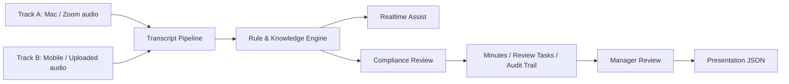

# SalesTalk / セルログ 2軸開発計画

作成日: 2026-05-25
更新日: 2026-06-11
目的: 既存の Mac 商談支援に加えて、保険営業向けのスマホ録音 + コンプラ議事録を同じ業務API基盤で進める。

中核方針は [セルログ AI-Native 業務API 計画](./selllog-ai-native-plan.md) を正とする。
STT 方針は [Apple SpeechAnalyzer ローカルSTT移行計画](./apple-speechanalyzer-stt-plan.md) を正とする。
Track A の週次実行計画は [MVP リリースロードマップ](./mvp-release-roadmap.md) を正とする。

## 0. 現在地

方向転換後も軸はぶれていない。入口の優先順位を変えただけで、中核は `transcript → rule engine → minutes → review → audit` の共通業務APIである。

2026-06-11 時点の実装状況:

| 領域 | 状態 | メモ |
|---|---|---|
| Mac local STT | 実装済み | Apple SpeechAnalyzer helper + TS provider + UI診断E2E |
| Deepgram | fallback化済み | `deepgram_fallback` / `deepgram_only` で明示利用 |
| 音声import→STT job | 実装済み | Deepgram prerecorded / Cloud worker側の基礎あり |
| コンプラルール | 実装済み | 会社別プリセット、商品別ルール、CRUD、承認フロー |
| 監査ログ | 実装済み | 検索・期間フィルタ・CSV/PDF export・改ざん検証 |
| 録音同意 | 実装済み | realtime / upload attestation の基礎あり |
| UI診断 | 実装済み | 診断開始からlocal transcript表示までE2Eで固定 |
| Mobile recorder | 未着手 | 次以降の入口開発 |
| Cloudflare β | 一部実装済み | R2 upload / Queues / auth基礎あり、運用化は次段階 |

直近は **Track A のlocal-first STTを実アプリで品質確認しつつ、Track B の訪問録音・保険コンプラ議事録へ下流を接続する**。

## 1. 方針

2つの入口を持つが、処理基盤は分けない。

| 軸 | 入口 | 主な利用シーン | 提供価値 | 優先顧客 |
|---|---|---|---|---|
| Track A | Mac 商談支援 | Zoom / オンライン商談 | リアルタイム反論対応、商談品質向上 | 複雑商材BtoB営業 |
| Track B | スマホ録音 + コンプラ議事録 | 訪問 / 対面の保険営業 | 募集品質管理、NG発話検知、上長レビュー効率化 | 保険代理店、保険会社、募集管理部門 |

共通の中核は `セルログ業務API` として扱う。UI、Macアプリ、スマホ、AIチャットはすべて同じAPIを叩くクライアントにする。

## 2. プロダクト定義

### Track A: Mac 商談支援

現行 SalesTalk の継続線。

- Zoom 音声を取得
- Apple SpeechAnalyzer でローカル文字起こし
- 反論検知
- Overlay で切り返し候補を表示
- 商談後に議事録、タスク、ナレッジ化

Deepgram は主力ではなく、Apple SpeechAnalyzer 非対応端末・クラウド許容顧客・Cloudflare β の fallback として残す。

### Track B: 保険営業コンプラ支援

訪問営業に合わせた新しい入口。

- スマホで録音開始
- 録音ファイルをアップロード
- transcript 化
- 会社別・商品別ルールに照合
- NG / 要注意 / 必須説明不足を検知
- 議事録にコンプラレビューを追加
- 上長が確認、差し戻し、教育に使う

最初から商談中リアルタイム警告を狙わない。訪問商談ではスマホ画面を見続ける UX が弱いため、MVP は商談後レビューを主軸にする。

### AI-Native 方針

AIはDBを直接読む補助チャットではなく、権限付きの業務APIを呼ぶ正規クライアントにする。

- UIもAIも同じAPIを使う
- コンプラ判定の不変条件はAPI/ルールエンジン側に置く
- LLMは最終判定者ではなく、要約・説明・言い換え・操作補助に使う
- すべての重要操作を audit log に残す

## 3. 共通アーキテクチャ

### 3.1 Meeting Source

すべての入力を `MeetingSource` として扱う。

| source | 内容 | 優先度 |
|---|---|---|
| `zoom_desktop` | Mac アプリの Zoom 音声 | 既存継続 |
| `mobile_recording` | スマホ録音 | Track B MVP |
| `uploaded_audio` | 音声ファイル手動投入 | mobile 前の検証入口 |
| `manual_transcript` | transcript 手動投入 | 開発・デモ用 |

### 3.2 共通データモデル

追加・整理する主要概念。

- `meeting_sessions`
  - `id`
  - `source`
  - `industry`
  - `company_id`
  - `product_id`
  - `started_at`
  - `ended_at`
- `transcript_segments`
  - `meeting_id`
  - `speaker`
  - `text`
  - `start_ms`
  - `end_ms`
  - `confidence`
- `compliance_rules`
  - `company_id`
  - `industry`
  - `product_category`
  - `severity`
  - `rule_type`
  - `pattern`
  - `reason`
  - `recommended_phrase`
- `compliance_findings`
  - `meeting_id`
  - `rule_id`
  - `transcript_segment_id`
  - `severity`
  - `quoted_text`
  - `reason`
  - `recommended_action`
  - `review_status`
- `meeting_minutes`
- `tasks`
- `manager_reviews`
- `review_tasks`
- `audit_logs`
- `presentation_blocks`

### 3.3 ルールエンジン

MVP はルールベースを主軸にする。LLM は補助判定。

| 判定方法 | 用途 | MVP採用 |
|---|---|---|
| 禁止語・正規表現 | 明確なNG発話 | 採用 |
| 必須説明チェック | 説明漏れ検知 | 採用 |
| 商品別ルール | 会社・商品ごとの差分 | 採用 |
| LLM分類 | 文脈依存の曖昧判定 | 補助 |
| 管理者レビュー学習 | 誤検知改善 | Phase 2 |

### 3.4 Storage 方針

Supabase 前提は外す。MVP は local-first、β は Cloudflare、Enterprise は AWS adapter を想定する。

| フェーズ | Storage | 理由 |
|---|---|---|
| Local MVP | local JSON / SQLite | 低コスト、keyなし検証、個人情報を端末内に置ける |
| Cloud β | Cloudflare D1 / R2 / Queues | 使い慣れている、スマホ/管理画面/API化と相性が良い |
| Enterprise | AWS | 大手・閉域・監査・SSO・個別セキュリティ要件に対応 |

実装では `Repository` interface を先に切り、`local` / `cloudflare` / `aws` adapter を差し替え可能にする。

### 3.5 STT 方針

Mac MVP の文字起こしは local-first に変更する。

| provider | 位置付け | 用途 |
|---|---|---|
| Apple SpeechAnalyzer | 第一候補 | Mac / Apple Silicon のリアルタイム文字起こし |
| Deepgram streaming | fallback | SpeechAnalyzer 非対応、顧客がクラウドSTTを許容する場合 |
| Deepgram prerecorded | batch fallback | アップロード音声の非同期処理 |
| manual transcript | 開発・デモ | keyなし検証、議事録/コンプラ下流確認 |

売り方は「音声を外部サーバーに預けない」「会議Bot不要」を前面に出す。

ただし Anthropic で議事録・カンペを生成する場合、transcript テキストは外部APIへ送る。この点は設定画面・同意文言で分けて説明する。

## 4. 保険営業向けユースケース

### 4.1 現場営業

1. スマホで録音開始
2. 顧客同意のチェックを記録
3. 商談終了
4. 自動で文字起こし
5. コンプラリスクと議事録が生成される
6. 必要なら上長確認に回る

### 4.2 上長・募集管理部門

1. 要確認商談だけを見る
2. リスク発話と該当ルールを確認
3. 問題なし / 要修正 / 要教育 / 重大リスクで分類
4. 営業マンへフィードバック
5. 月次で傾向を見る

### 4.3 営業教育

1. よくあるNG表現を集計
2. 言い換え例を提示
3. 新人の商談を重点レビュー
4. 会社ルールを現場会話に落とし込む

## 5. MVP スコープ

### MVP 1: 共通基盤の整理

目的: Mac / mobile / upload を同じ transcript pipeline に乗せる。

- [x] `MeetingSource` 型を追加
- [x] transcript segment の共通保存
- [x] local / Cloudflare / AWS を見据えた repository 境界
- [x] 議事録生成を source 非依存にする
- [x] compliance finding の型とスキーマを追加
- [x] review task / audit log / presentation block の型を追加

完了条件:

- [x] dev transcript 注入、Mac audio、upload transcript が同じ downstream に流れる
- [x] E2E で source 違いを確認できる

### MVP 2: 保険コンプラルールエンジン

目的: key なしでも会社別ルールで発話を検知できる。

- [x] ルール CRUD
- [x] 禁止表現検知
- [x] 要注意表現検知
- [x] 必須説明チェック
- [x] finding を議事録に出す
- [x] severity: `critical` / `high` / `medium` / `low`

完了条件:

- [x] 「絶対儲かります」「告知しなくて大丈夫」などを検知
- [x] 議事録にコンプラレビュー欄が出る
- [x] 管理者レビュー用の一覧が見られる

### MVP 3: 音声ファイルアップロード

目的: スマホアプリ前に、訪問商談の検証を始める。

- [x] `.m4a` / `.mp3` / `.wav` import
- [x] Apple SpeechAnalyzer / Deepgram batch / Deepgram streaming を切り替えられる抽象化
- [x] transcript を meeting session に紐付け
- [x] コンプラ議事録生成
- [ ] Apple SpeechAnalyzer batch/import provider の本接続

完了条件:

- [x] iPhone ボイスメモ等で録った音声を取り込める
- [x] 保険コンプラレポートが生成される
- [ ] local STT だけでupload音声を処理できる

### MVP 4: Mobile Recorder

目的: 訪問営業で録音開始からアップロードまで完結する。

- iOS 優先
- 録音開始 / 停止
- 顧客同意チェック
- 録音メタデータ入力
- アップロード
- 処理状況表示

完了条件:

- 営業マンが訪問先で録音し、管理画面に議事録とコンプラ結果が出る

### MVP 5: AI Operator

目的: AIチャットが業務APIを安全に操作できる状態にする。

- tool schema
- tool execution gateway
- permission guard
- audit log
- presentation JSON response
- AI chat UI

完了条件:

- 「今月の高リスク面談を出して」などの自然言語指示が、権限付きAPI経由で処理される

## 6. 開発ロードマップ

### Phase 0: 現状維持と土台整理

期間目安: 1週

- [x] 既存 Mac app の keyless E2E 維持
- [x] `MeetingSource` 設計
- [x] compliance finding schema
- [x] local repository の整理
- [x] review task / audit log / presentation block schema
- [x] README / PRD / 計画書のセルログ化

### Phase 1: 保険コンプラMVP

期間目安: 2週

- [x] 保険向け rule engine
- [x] 会社別ルール登録
- [x] transcript へのルール照合
- [x] 議事録への compliance review 追加
- [x] 管理者レビュー UI の最小版
- [x] review task 生成
- [x] Presentation JSON の最小 renderer

### Phase 2: Upload Audio MVP

期間目安: 1〜2週

- [x] 音声ファイル import
- [x] STT ジョブ化
- [x] transcript 保存
- [x] compliance report 生成
- [x] CSV / PDF export の検討
- [ ] Apple SpeechAnalyzer batch/import 処理

### Phase 3: Mobile Recorder MVP

期間目安: 3〜4週

- iOS 録音アプリ
- 認証または簡易テナントコード
- 音声アップロード
- 処理ステータス
- 同意取得チェック

### Phase 4: Cloudflare β

期間目安: 2〜4週

- Workers API skeleton
- D1 schema
- R2 audio upload
- Queues worker
- tenant / company scope
- audit log
- local adapter と cloudflare adapter の切替

### Phase 5: Mac リアルタイム高度化

期間目安: 並行継続

- [ ] 実 Zoom audio smoke
- [x] Apple SpeechAnalyzer 実機 smoke
- [x] Deepgram fallback 疎通
- [x] Anthropic 本番回答生成
- [ ] Cohere / Cloudflare or local RAG
- [ ] Overlay UX 改善

## 7. 実装優先順位

次に手を動かす順番。完了済みの土台を前提に、実商談品質とTrack Bへ寄せる。

1. 実アプリで本人音声・Zoom system audio のlocal STT品質確認
2. transcript metadata / audit log に `stt.provider=apple_speech_analyzer` を残す
3. local STT transcript から議事録・コンプラレビューをワンクリック確認
4. Apple SpeechAnalyzer batch/import provider を追加
5. 音声importの既定providerを local-first に変更
6. Mobile recorder PoC の録音/同意/アップロード最小実装
7. Cloudflare API とmobile uploadの接続
8. 管理者向け月次レポート・提出用exportの条件指定強化
9. 実代理店ルールのサンプル投入
10. iOS recorder PoC

## 8. あなたがやる必要がある作業

開発以外で必須。

- 保険会社・代理店の具体ルール例を入手
- 会社別に「禁止」「注意」「必須説明」のサンプルを10〜30件作る
- 録音同意の運用方針を決める
- 保険募集コンプラに詳しい人へ初期レビュー依頼
- Anthropic key 発行
- Deepgram key 発行はfallback検証用
- Cloudflare アカウントと Workers / D1 / R2 利用方針
- iOS 配布するなら Apple Developer Program
- 実際の訪問商談録音サンプルを用意

## 9. リスクと対策

| リスク | 内容 | 対策 |
|---|---|---|
| 録音同意 | 無断録音への懸念 | 録音前チェック、同意文言、ログ保存 |
| 営業マンの反発 | 監視ツールに見える | 「営業マンを守る」訴求、教育用途を前面に |
| 誤検知 | 文脈を見ずにNG扱い | severity分け、上長レビュー、LLM補助 |
| 会社別ルール差分 | ルールが会社ごとに違う | company_id / product_category で分離 |
| 法務責任 | 判定が法的助言に見える | 「要確認」扱い、最終判断は管理者 |
| スマホ録音UX | 訪問中に操作が増える | 録音開始/停止だけに絞る |

## 10. 成功指標

### Track A

- 商談中の提案採用率
- 反論検知 precision
- 回答生成 latency
- 商談後議事録の修正時間

### Track B

- 要確認商談の抽出率
- 上長レビュー時間の削減
- 重大リスク発話の検知件数
- 営業マンへの差し戻し件数
- 新人教育での改善率

## 11. 現時点の結論

2軸で進める。ただし実装は2プロダクトに分裂させない。

- Mac はリアルタイム商談支援の入口
- スマホは訪問録音とコンプラ議事録の入口
- transcript / rule engine / minutes / tasks / review は共通

直近の開発は、Apple SpeechAnalyzer local-first STTを実商談で使える品質へ寄せながら、訪問録音・upload音声を同じコンプラ議事録pipelineへ流すことに集中する。
